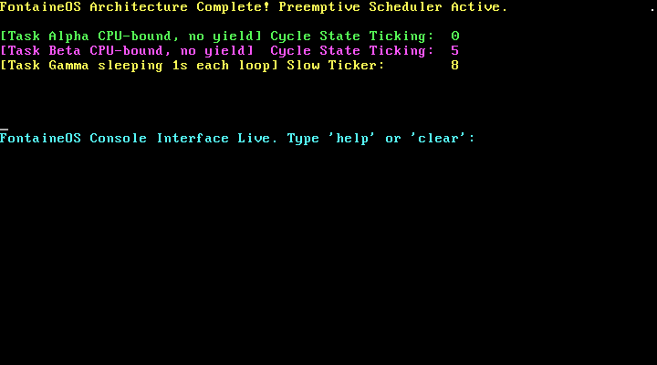
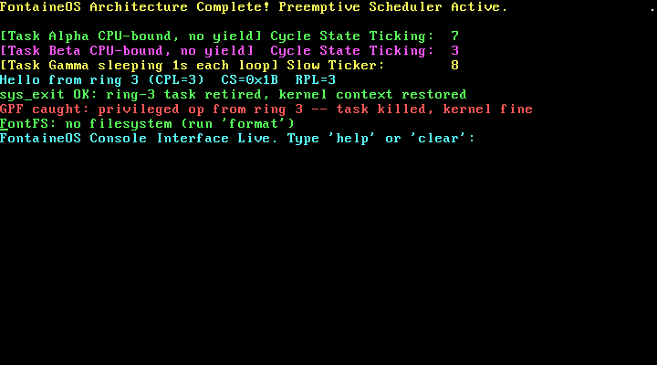
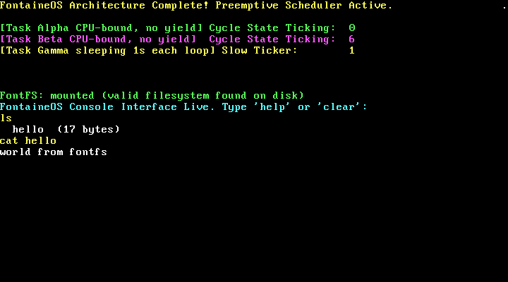
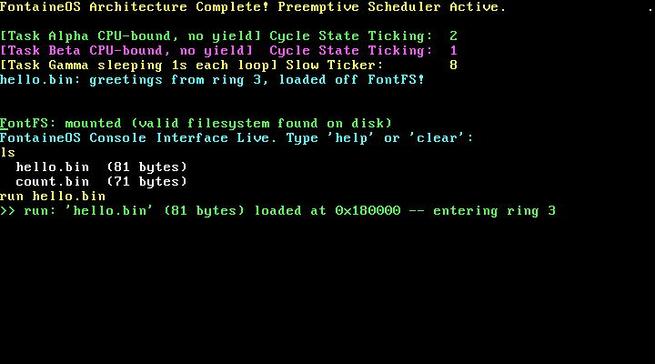
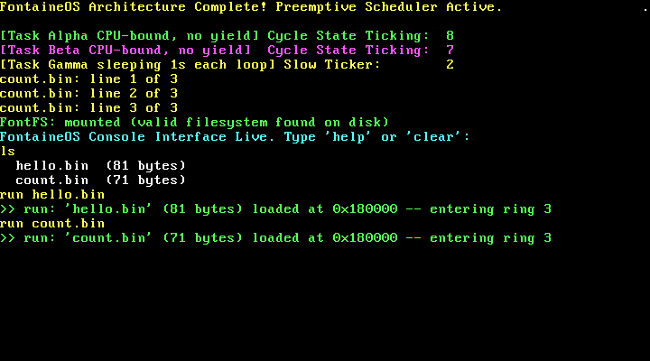
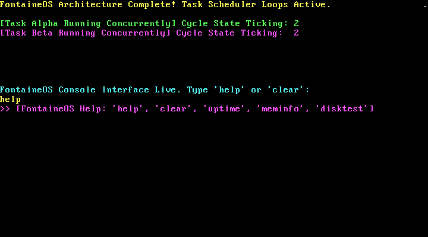

<picture>
  <source media="(prefers-color-scheme: dark)" srcset="assets/logo.png">
  <source media="(prefers-color-scheme: light)" srcset="assets/logo2.png">
  
</picture>

# FontaineOS

FontaineOS is an advanced, bare-metal x86 micro-kernel operating system built entirely from scratch using Freestanding C++20 and x86 Assembly. Operating with absolutely zero external runtime dependencies and completely divorced from the standard library (`libstdc++`/`glibc`), it manages raw x86 CPU systems, configures physical registers, routes asynchronous hardware lines, and orchestrates an interactive block-storage terminal workstation [x].

For the full technical tour — boot path, GDT/IDT layout, scheduler internals, FontFS on-disk format, the ring-3 model, and the user program ABI — see **[docs/ARCHITECTURE.md](docs/ARCHITECTURE.md)**.

---

## 🔧 Core Architectural Principles
* **Pure Freestanding Architecture:** Zero runtime abstraction layers. Built with strict `-ffreestanding` parameters, managing all low-level system attributes manually [x].
* **Hardware Register Layer Translation:** Directly manipulates hardware lines through inline assembly port interactions (`inb`, `outb`, `insw`, `outsw`) [x].
* **Atomic Protection & Synchronization:** Shields volatile memory tracking arrays using strict hardware interrupt constraints (`cli`/`sti`) [x].

---

## ✨ Feature Overview

* **Preemptive multitasking** — the PIT fires at 100 Hz (IRQ 0) and drives a
  round-robin scheduler directly from the timer interrupt. Tasks are
  READY/RUNNING/SLEEPING thread control blocks on a circular ring with private
  4 KB stacks; the context switch is a dedicated assembly routine
  (`context_switch` in `src/boot.s`). CPU-bound tasks with *no yield anywhere*
  share the CPU, and `sleep(ticks)` parks a task until its wake tick.
* **FontFS** — a tiny persistent on-disk filesystem over the polling ATA/IDE
  driver: superblock at LBA 0, a one-sector file table of 16 × 32-byte entries
  at LBA 1, and 16 fixed 8192-byte file regions from LBA 2. Files written from
  the shell survive a real power cycle. Limits: 16 files, 8 KB per file,
  19-character names.
* **Ring 3 user mode + `int 0x80` syscalls** — a 6-entry GDT (kernel/user
  code+data plus a TSS) lets the kernel drop to CPL=3 via the `iret` trick
  (`enter_usermode`) and come back through `kernel_reentry`. User code is fully
  preemptible, cannot execute privileged instructions (a deliberate ring-3
  `cli` is caught by the GPF handler, which kills the task while the kernel
  keeps running), and talks to the kernel only through the DPL=3 `int 0x80`
  gate: `sys_write`, `sys_yield`, `sys_exit` (+ a `sys_read` stub).
* **User program loader (`run`)** — the shell's `run <file>` command loads a
  flat binary from FontFS into the fixed region at `0x180000` and hands it to
  a launcher task that performs the ring-3 drop *outside* interrupt context.
  Sample programs `user/hello.asm` and `user/count.asm` are assembled with
  `nasm -f bin` and injected onto the disk image with `make inject`.
* **Interactive shell** — an interrupt-driven keyboard console with system
  diagnostics (`uptime`, `meminfo`, `disktest`), full FontFS file management,
  terminal scrolling, and the program loader.
* **Memory management** — physical page bitmap over 64 MB (`src/pmm.cpp`),
  identity-mapped paging of the first 4 MB (`src/vmm.cpp`), and a first-fit
  `kmalloc`/`kfree` heap at `0x300000` (`src/heap.cpp`).

---

## 📸 Screenshots

Captured headlessly from QEMU by `tools/qemu_test.py` during milestone verification.

**Boot + preemptive scheduler.** Alpha and Beta are CPU-bound loops with no
yield; Gamma sleeps 1 s per loop. All tickers advance concurrently:



**Ring 3, twice proven.** The user task prints its own CS register
(`CS=0x1B RPL=3` — the CPU cannot lie about CS), retires via `sys_exit`, and a
second task's deliberate `cli` is caught as a GPF and killed while the kernel,
shell, and scheduler keep running:




**FontFS persistence.** `ls` and `cat` after a full reboot — the file written
before the power cycle is still there:



**User programs off the disk.** `run hello.bin` and `run count.bin` load flat
binaries from FontFS at `0x180000` and execute them at ring 3:




**The shell:**



---

## 🛠 Building & Running

Toolchain: `nasm`, 32-bit-capable `g++`/`ld`, `qemu-system-i386`, `python3`.
(No root? `sh tools/sandbox_setup.sh` installs nasm + QEMU into a private
prefix — see [tools/README.md](tools/README.md).)

```sh
mkdir -p bin        # first checkout only
make all            # kernel (bin/fontaineos.bin) + 10MB disk image + user .bin programs
make inject         # write user/hello.bin + user/count.bin into the disk image's FontFS
make run            # boot it: qemu-system-i386 -kernel bin/fontaineos.bin -drive file=bin/disk.img,...
```

`make inject` runs `tools/fontfs_inject.py`, which formats the image on first
use and reports the resulting directory:

```
python3 tools/fontfs_inject.py bin/disk.img user/hello.bin user/count.bin
formatting: writing fresh superblock + empty file table
injected 'hello.bin' (81 bytes) into slot 0 (LBA 2)
injected 'count.bin' (71 bytes) into slot 1 (LBA 18)
  hello.bin                81 bytes  @LBA 2
  count.bin                71 bytes  @LBA 18
```

Other targets: `make clean` removes objects, binaries, the disk image, and
built user programs. `tools/qemu_test.py` boots the kernel headlessly, types
shell commands via the QEMU monitor, and captures PNG screendumps — that is
how the screenshots above were produced. `build.sh` is a legacy all-in-one
lifecycle script (clean, image creation, build, backup, git push, QEMU); for
day-to-day work prefer the make targets above.

Compilation flags: `g++ -m32 -ffreestanding -O2 -Wall -Wextra -fno-exceptions
-fno-rtti -std=c++20`, `ld -m elf_i386 -T linker.ld`, `nasm -f elf32` for the
kernel and `nasm -f bin` for user programs (see `Makefile`).

---

## ⌨️ Shell Command Reference

The shell lives on the lower rows of the VGA console; type a command and press Enter.

### System

| Command | Effect |
|---|---|
| `help` | list all commands |
| `clear` | clear the shell area of the screen |
| `uptime` | seconds since boot plus raw PIT ticks, e.g. `>> Uptime: 12 seconds (1234 hardware ticks @ 100Hz)` |
| `meminfo` | PMM page usage, free KB, and live scheduler thread count |
| `disktest` | write a test string to disk sector 1, zero the buffer, read it back, print it |

### FontFS

| Command | Effect |
|---|---|
| `format` | write a fresh superblock + empty file table (erases all files) |
| `ls` | list files with sizes |
| `cat <file>` | print a file's contents |
| `write <file> <text...>` | create-or-overwrite a file with the given text (spaces preserved) |
| `touch <file>` | create an empty file |
| `rm <file>` | delete a file |

### Programs

| Command | Effect |
|---|---|
| `run <file>` | load a flat binary from FontFS at `0x180000` and execute it at ring 3 |

```
run hello.bin
>> run: 'hello.bin' (81 bytes) loaded at 0x180000 -- entering ring 3
```

Limits worth knowing at the prompt: 16 files max, 8192 bytes per file,
filenames up to 19 characters. `run` refuses while a previous program is still
running, and binaries cannot be typed in with `write` — put them on the disk
with `make inject`.

---

## 📦 Repository Layout

| Path | Contents |
|---|---|
| `src/` | kernel sources: `boot.s` (entry, interrupt stubs, context switch, ring transitions), `kernel.cpp` (init + demo tasks), `gdt/idt/timer/keyboard/pmm/vmm/heap/task/ata/fontfs/syscall` |
| `include/` | matching headers — `fontfs.h` and `syscall.h` double as the FontFS format spec and the user program ABI spec |
| `user/` | user programs (`hello.asm`, `count.asm`), assembled to flat binaries |
| `tools/` | host-side tooling: FontFS injector, headless QEMU test harness, rootless toolchain installer — see [tools/README.md](tools/README.md) |
| `docs/` | [ARCHITECTURE.md](docs/ARCHITECTURE.md), screenshots, and the original architecture notes |
| `linker.ld` | links the kernel at the 1 MB mark |
